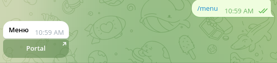
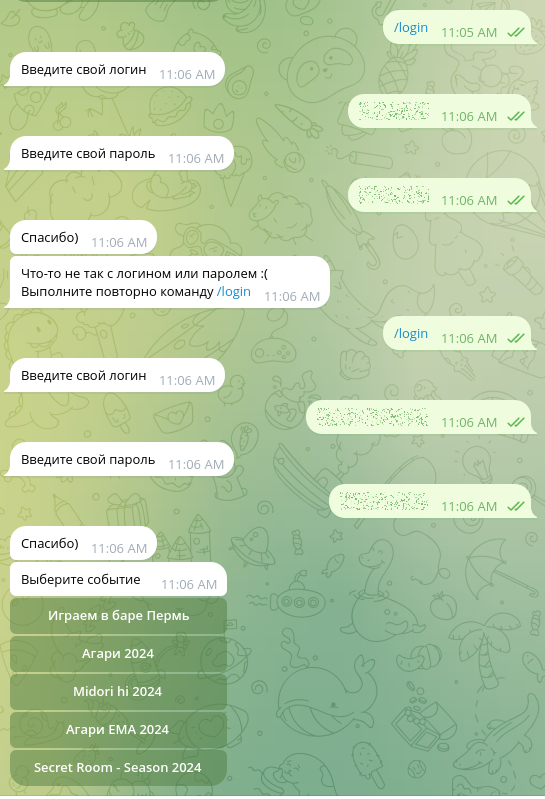
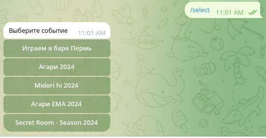

## Creating telegram bot

First of all you need to get token from telegram.

https://core.telegram.org/bots/tutorial#obtain-your-bot-token


## Configuring

Create file config.json and fill with this body:

```json
{
 "login": "<your-login-from-panteon> (fill or leave empty)",
 "password": "<your-password-from-panteon> (fill or leave empty)",
 "token": "<your-token-for-telegram-bot>"
}
```

login and password you can insert later in chat with telegram bot

## Running

- Unix
  ```shell
  ./telebot
  ```
- Windows
  just run telebot.exe
  Sometimes you need to add telebot.exe to antivirus exceptions

## Commands in chat
```
./menu
```



```
./login
```


```
./select
```

